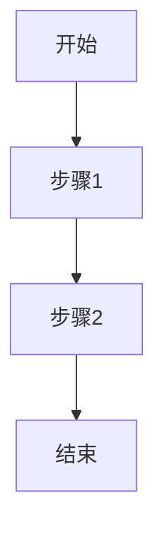

# 基于OxyGent和JoyCode实现智能流程图生成工具案例实践

## 概述

`create_flow_image_demo.py` 是一个基于 OxyGent 框架的多代理系统（Multi-Agent System, MAS）示例，展示了如何利用多代理协作实现智能流程图自动生成任务。该示例主要演示了通过 OpenAI 兼容 API 生成 Mermaid 流程图代码，并将其渲染为可视化 HTML 文件的功能，同时展示了多代理系统中的任务分配、协作和执行流程。

### 核心特点

- **多代理协作**：主控代理（Master Agent）智能协调流程图生成和打开操作
- **Mermaid 流程图**：使用 Mermaid 语法生成专业的流程图
- **OpenAI 兼容 API**：调用 OpenAI 兼容接口将文本描述转换为 Mermaid 代码
- **Web 服务接口**：基于 FastAPI 提供用户交互界面
- **模块化设计**：将流程图生成、打开功能和静态文件管理分离为独立模块
- **智能决策**：主控代理能够根据用户输入智能选择合适的工具和策略
- **实时预览功能**：支持编辑 Mermaid 代码并实时预览流程图
- **导出功能**：支持将流程图导出为 SVG 和 PNG 格式
- **错误降级机制**：API 调用失败时自动使用高质量备用流程图

### 技术栈

- **OxyGent**：多代理系统框架
- **OpenAI 兼容 API**：大语言模型接口
- **Mermaid**：流程图生成库
- **FastAPI**：Web 服务框架
- **FunctionHub**：工具函数组织框架

## 环境准备

### 系统要求

- Python 3.10+
- OpenAI 兼容的 LLM API 服务

### 依赖安装

1. 安装 Python 依赖：

```bash
# 创建并激活虚拟环境
python -m venv .venv
source .venv/bin/activate  # Linux/macOS
# 或
.venv\Scripts\activate  # Windows

# 安装依赖
pip install -r requirements.txt
```

### 环境变量配置

在项目根目录创建 `.env` 文件，配置以下环境变量（本示例中使用了硬编码值，但推荐使用环境变量）：

```
DEFAULT_LLM_BASE_URL=**
DEFAULT_LLM_MODEL_NAME=**
DEFAULT_LLM_API_KEY=**
```

## 快速启动

### 运行示例

1. 确保已激活虚拟环境：

```bash
source .venv/bin/activate  # Linux/macOS
# 或
.venv\Scripts\activate  # Windows
```

2. 确保 API 服务可访问：

```bash
# 测试 API 连接
curl -X POST "http://**/v1/chat/completions" \
  -H "Content-Type: application/json" \
  -H "Authorization: Bearer **" \
  -d '{"model": "**", "messages": [{"role": "user", "content": "Hello"}]}'
```

3. 运行示例程序：

```bash
python examples/other/create_flow_image_demo.py
```

4. 程序启动后，会自动打开浏览器访问 Web 界面：

```
http://127.0.0.1:8081/web/index.html
```

### 使用方法

1. **默认查询**：程序启动后会自动执行"请生成一个软件开发流程图，包括需求分析、设计、编码、测试和部署阶段"
2. **自定义查询**：在 Web 界面输入框中输入自定义流程图描述，例如：
   - "生成一个项目管理流程图，包括启动、规划、执行、监控和收尾阶段"
   - "创建一个用户注册流程图"
   - "画一个订单处理的流程图"
3. **查看结果**：
   - 流程图会自动在浏览器中打开
   - HTML 文件会保存在项目目录中，文件名格式为 `software-development-workflow.html`
4. **编辑和预览**：
   - 在打开的流程图页面中，可以直接编辑 Mermaid 代码
   - 点击"更新预览"按钮可以实时预览修改后的流程图
   - 支持多种预设模板选择
5. **导出图表**：
   - 点击"导出 SVG"按钮可以将流程图导出为 SVG 格式
   - 点击"导出 PNG"按钮可以将流程图导出为 PNG 格式

### 停止程序

在终端中按 `Ctrl+C` 停止程序，或使用以下命令终止进程：

```bash
pkill -f "python examples/other/create_flow_image_demo.py"
```

## 关键功能实现

### 多代理系统架构

```
master_agent
├── image_gen_agent
│   └── generate_flow_chart
├── open_chart_agent
│   └── open_html_chart
├── generate_flow_chart
└── open_html_chart
```

系统由一个主控代理和两个子代理组成：

1. **Master Agent**：负责智能任务协调和分发，具备完整的决策能力
2. **Image Gen Agent**：专门负责流程图生成任务
3. **Open Chart Agent**：专门负责在浏览器中打开流程图文件
4. **直接工具访问**：主控代理也可以直接调用工具函数

### 流程图生成实现

核心功能 `generate_flow_chart` 实现了智能流程图生成：

```python
@flow_image_gen_tools.tool(
    description="根据文本描述生成 Mermaid 流程图并返回 HTML 文件路径。此工具使用 OpenAI 兼容 API 将文本描述转换为 Mermaid 流程图代码，然后生成可视化的 HTML 文件并在浏览器中打开。"
)
async def generate_flow_chart(description: str, output_path: str = None) -> str:
    """
    根据文本描述生成 Mermaid 流程图并在浏览器中打开
    
    Args:
        description: 流程图的文本描述
        output_path: 输出的 HTML 文件路径，默认为 "flowchart.html"
        
    Returns:
        str: 生成的 HTML 文件的路径
    """
    try:
        # 如果没有提供输出路径，则生成带有时间戳的默认文件名
        if output_path is None:
            # 使用绝对路径，确保文件创建在正确的位置
            output_path = os.path.abspath(f"software-development-workflow.html")
        else:
            # 确保输出路径是绝对路径
            output_path = os.path.abspath(output_path)
            
            # 确保输出目录存在
            output_dir = os.path.dirname(output_path)
            if output_dir and not os.path.exists(output_dir):
                os.makedirs(output_dir, exist_ok=True)
        
        # 调用 OpenAI 兼容 API 生成 Mermaid 代码
        mermaid_code = call_openai_api(description)
        
        # 创建 HTML 文件并渲染流程图
        if create_html_with_mermaid(mermaid_code, output_path):
            # 自动在浏览器中打开生成的文件
            import webbrowser
            try:
                webbrowser.open(f"file://{output_path}")
                return f"✅ 流程图已生成并在浏览器中打开: {output_path}"
            except Exception as e:
                print(f"打开浏览器时出错: {e}")
                return f"✅ 流程图已生成并保存到: {output_path}，请手动打开文件"
        else:
            return "❌ 生成流程图时出错"
    except Exception as e:
        print(f"generate_flow_chart 函数执行出错: {e}")
        return f"❌ 生成流程图时出错: {str(e)}"
```

#### OpenAI 兼容 API 调用实现

`call_openai_api` 函数负责调用 OpenAI 兼容 API 生成 Mermaid 流程图代码：

```python
def call_openai_api(description):
    """调用 OpenAI 兼容 API 生成 Mermaid 代码"""
    try:
        prompt = DEFAULT_PROMPT_TEMPLATE.format(description=description)
        
        headers = {
            "Content-Type": "application/json",
            "Authorization": f"Bearer {API_KEY}"
        }
        
        # OpenAI API 格式
        data = {
            "model": MODEL_NAME,
            "messages": [
                {"role": "user", "content": prompt}
            ],
            "temperature": 0.1,
            "max_tokens": 2000,
            "stream": False
        }
        
        print("正在调用 OpenAI 兼容 API 生成流程图代码...")
        print(f"请求URL: {API_BASE_URL}/chat/completions")
        print(f"请求模型: {MODEL_NAME}")
        
        response = requests.post(f"{API_BASE_URL}/chat/completions", headers=headers, json=data, timeout=30)
        
        print(f"API 响应状态: {response.status_code}")
        
        if response.status_code != 200:
            print(f"API 请求失败，状态码: {response.status_code}")
            print(f"响应内容: {response.text}")
            return generate_sample_mermaid()
        
        result = response.json()
        
        # OpenAI API 标准格式
        if "choices" in result and len(result.get("choices", [])) > 0:
            content = result["choices"][0]["message"]["content"]
            print(f"API 调用成功，内容长度: {len(content)}")
        else:
            print(f"无法识别的 API 响应格式: {result}")
            return generate_sample_mermaid()
            
        # 提取 Mermaid 代码
        mermaid_code = extract_mermaid_code(content)
        if not mermaid_code:
            print("未能从 API 响应中提取有效的 Mermaid 代码，将使用示例流程图")
            return generate_sample_mermaid()
        
        print("成功提取 Mermaid 代码")
        return mermaid_code
        
    except requests.exceptions.RequestException as e:
        print(f"网络请求错误: {e}")
        return generate_sample_mermaid()
    except Exception as e:
        print(f"调用 API 时出错: {e}")
        return generate_sample_mermaid()
```

#### 备用流程图生成

系统提供了高质量的备用流程图，确保在 API 调用失败时仍能提供有价值的结果：

```python
def generate_sample_mermaid():
    """生成示例 Mermaid 流程图代码"""
    return """flowchart TD
    A[需求分析] --> B[系统设计]
    B --> C[技术选型]
    C --> D[架构设计]
    D --> E[编码实现]
    E --> F[单元测试]
    F --> G[集成测试]
    G --> H{测试通过?}
    H -->|是| I[代码审查]
    H -->|否| E
    I --> J[部署准备]
    J --> K[生产部署]
    K --> L[监控运维]
    L --> M[用户反馈]
    M --> N{需要优化?}
    N -->|是| A
    N -->|否| O[项目完成]
    
    style A fill:#e1f5fe
    style O fill:#c8e6c9
    style H fill:#fff3e0
    style N fill:#fff3e0"""
```

### 流程图HTML 文件生成实现

`create_html_with_mermaid` 函数负责将 Mermaid 代码转换为可视化的 HTML 文件，并提供实时预览和导出功能：

```python
def create_html_with_mermaid(mermaid_code, output_path):
    """创建包含可交互编辑的 Mermaid 流程图的 HTML 文件"""
    html_content = f"""
    <!DOCTYPE html>
    <html lang="zh-CN">
    <head>
        <meta charset="UTF-8">
        <meta name="viewport" content="width=device-width, initial-scale=1.0">
        <title>交互式 Mermaid 流程图编辑器</title>
        <script src="https://cdn.jsdelivr.net/npm/mermaid@10/dist/mermaid.min.js"></script>
        <script src="https://cdnjs.cloudflare.com/ajax/libs/codemirror/5.65.2/codemirror.min.js"></script>
        <!-- 完整的 HTML 样式和布局 -->
    </head>
    <body>
        <div class="container">
            <h1>交互式 Mermaid 流程图编辑器</h1>
            
            <div class="template-selector">
                <label for="template-select">选择模板：</label>
                <select id="template-select" onchange="loadTemplate()">
                    <option value="custom">自定义</option>
                    <option value="software-dev">软件开发流程</option>
                    <option value="project-management">项目管理流程</option>
                    <option value="business-process">业务流程</option>
                    <option value="decision-tree">决策树</option>
                </select>
            </div>
            
            <div class="editor-container">
                <div class="editor-panel">
                    <h2>Mermaid 代码编辑器</h2>
                    <textarea id="code-editor">{mermaid_code}</textarea>
                </div>
                
                <div class="preview-panel">
                    <h2>实时预览</h2>
                    <div id="preview" class="mermaid">
{mermaid_code}
                    </div>
                    <div id="render-error" class="error-message" style="display:none;"></div>
                </div>
            </div>
            
            <div class="button-group">
                <button onclick="updatePreview()">更新预览</button>
                <button onclick="exportSVG()">导出 SVG</button>
                <button onclick="exportPNG()">导出 PNG</button>
            </div>
            
            <div class="footer">
                <p>由 OxyGent 和 Mermaid.js 提供支持 | {datetime.datetime.now().strftime('%Y-%m-%d %H:%M:%S')}</p>
            </div>
        </div>
        
        <script>
            // JavaScript 代码实现实时预览和导出功能
        </script>
    </body>
    </html>
    """
    
    try:
        with open(output_path, 'w', encoding='utf-8') as f:
            f.write(html_content)
        print(f"已保存流程图到: {output_path}")
        return True
    except Exception as e:
        print(f"保存 HTML 文件时出错: {e}")
        return False
```

### 浏览器打开流程图html文件实现

`open_html_chart` 函数实现了在浏览器中打开 HTML 文件：

```python
@open_chart_tools.tool(
    description="在浏览器中打开生成的流程图 HTML 文件"
)
async def open_html_chart(file_path: str) -> str:
    """
    在浏览器中打开生成的流程图 HTML 文件
    
    Args:
        file_path: HTML 文件路径
        
    Returns:
        str: 操作结果消息
    """
    try:
        # 确保使用绝对路径
        if not os.path.isabs(file_path):
            output_path_abs = os.path.abspath(file_path)
        else:
            output_path_abs = file_path
            
        # 检查文件是否存在
        if not os.path.exists(output_path_abs):
            return f"错误：文件不存在: {output_path_abs}"
            
        print(f"正在打开文件: {output_path_abs}")
        webbrowser.open(f"file://{output_path_abs}")
        return f"已在浏览器中打开流程图: {output_path_abs}"
    except Exception as e:
        return f"打开浏览器时出错: {e}\n请手动打开生成的文件: {file_path}"
```

### 多代理系统配置

系统通过 `oxy_space` 配置和初始化多代理系统：

```python
oxy_space = [
    oxy.HttpLLM(
        name="default_llm",
        api_key="**",
        base_url="**",
        model_name="**",
    ),

    flow_image_gen_tools,
    open_chart_tools,
    oxy.ReActAgent(
        name="image_gen_agent",
        tools=["flow_image_gen_tools"],
        desc="流程图生成代理,"
    ),
    oxy.ReActAgent(
        name="open_chart_agent",
        tools=["open_chart_tools"],
        desc="在浏览器中打开流程图代理"
    ),
    oxy.ReActAgent(
        name="master_agent",
        llm_model="default_llm",
        is_master=True,
        sub_agents=["image_gen_agent","open_chart_agent"],
        prompt_template=MASTER_AGENT_PROMPT,
        tools=["flow_image_gen_tools", "open_chart_tools"],
    ),
]
```

### Web 服务配置

系统使用 FastAPI 创建 Web 服务，并配置了静态文件和 API 路由：

```python
# 创建FastAPI应用
app = FastAPI(title="Mermaid流程图交互式编辑器", description="基于OxyGent和Mermaid的流程图生成与编辑工具")

# 添加CORS中间件
app.add_middleware(
    CORSMiddleware,
    allow_origins=["*"],
    allow_credentials=True,
    allow_methods=["*"],
    allow_headers=["*"],
)

# 添加API路由
from oxygent.chart.flowchart_api import router as flowchart_router
app.include_router(flowchart_router, prefix="/api")

# 添加根路径路由
@app.get("/")
async def read_root():
    return RedirectResponse(url="/static/index.html")

# 注意：静态文件挂载必须在API路由之后，否则会覆盖API路由
app.mount("/static", StaticFiles(directory="oxygent/chart/web"), name="web")
```

### 智能决策提示系统

系统使用 `MASTER_AGENT_PROMPT` 来定义主控代理的智能行为和决策逻辑：

```python
MASTER_AGENT_PROMPT = """
你是一个智能流程图助手，专门负责分析用户需求并智能选择合适的代理来完成任务。

## 核心职责
1. 智能分析用户输入的意图和需求
2. 根据关键词和语义判断应该使用哪个代理
3. 合理调度子代理或直接使用工具
4. 提供清晰的任务执行反馈

## 可用代理和工具

### image_gen_agent (流程图生成代理)
- **工具**: generate_flow_chart
- **功能**: 根据文本描述生成 Mermaid 流程图并自动在浏览器中打开
- **参数**:
  - description (必需): 流程图的详细文本描述
  - output_path (可选): 输出HTML文件路径
- **触发关键词**: 生成、创建、制作、画、设计、新建、开发流程图等

### open_chart_agent (图表打开代理)
- **工具**: open_html_chart  
- **功能**: 在浏览器中打开已存在的流程图HTML文件
- **参数**:
  - file_path (必需): HTML文件的完整路径
- **触发关键词**: 打开、查看、显示、浏览已有/现有的流程图等

### 直接工具访问
你也可以直接调用以下工具而不通过子代理：
- generate_flow_chart: 直接生成流程图
- open_html_chart: 直接打开流程图文件

## 智能决策规则

### 规则1: 生成新流程图
**触发条件**: 用户提到"生成"、"创建"、"制作"、"画"、"设计"、"新的"等词汇，并描述了流程内容
**执行策略**: 
- 优先使用 image_gen_agent 或直接调用 generate_flow_chart
- 提取用户描述的流程内容作为 description 参数
- 自动生成合适的文件名作为 output_path

**示例输入**:
- "请生成一个软件开发流程图"
- "帮我创建一个用户注册流程"
- "画一个订单处理的流程图"

### 规则2: 打开现有流程图
**触发条件**: 用户提到"打开"、"查看"、"显示"现有的/已有的流程图文件
**执行策略**:
- 使用 open_chart_agent 或直接调用 open_html_chart
- 需要用户提供文件路径，如果没有提供则询问

## 执行流程

1. **意图识别**: 分析用户输入，识别核心动作词和目标对象
2. **代理选择**: 根据决策规则选择最适合的代理或工具
3. **参数提取**: 从用户输入中提取必要的参数信息
4. **执行任务**: 调用选定的代理或工具
5. **结果反馈**: 向用户报告执行结果和后续操作建议

## 注意事项
- 始终优先理解用户的真实意图
- 如果用户输入不明确，主动询问澄清
- 对于复杂请求，分步骤执行并及时反馈进度
- 确保每次操作后都提供清晰的状态说明和后续建议
"""
```

系统使用 `DEFAULT_PROMPT_TEMPLATE` 来控制Mermaid流程图的生成：

```python
DEFAULT_PROMPT_TEMPLATE = """
请根据以下描述生成一个 Mermaid 流程图代码：

{description}

不需要询问更多信息，直接根据描述生成一个完整的流程图。
流程图应该包括所有提到的阶段，并且使用合适的图形元素和连接线。

请只返回 Mermaid 代码，不要包含任何其他解释、说明或问题。代码应该以 ```mermaid 开头，以 ``` 结尾。

示例格式：

"""
```

## 总结

### 最佳实践要点

1. **智能多代理协作**：通过主控代理的智能决策，实现复杂任务的自动分解和执行
2. **模块化设计**：将流程图生成、打开功能和静态文件管理分离为独立模块，提高代码可维护性
3. **提示工程优化**：使用详细的提示语指导 LLM 生成高质量的 Mermaid 代码
4. **完善错误处理**：实现了完善的错误处理和降级机制，确保系统在各种情况下都能正常运行
5. **用户体验优化**：自动在浏览器中打开生成的流程图，提供直观的可视化结果
6. **实时交互功能**：支持编辑 Mermaid 代码并实时预览流程图，提高用户体验
7. **多格式导出**：支持将流程图导出为 SVG 和 PNG 格式，方便用户使用
8. **API 兼容性**：使用标准的 OpenAI 兼容接口，易于集成不同的 LLM 服务

### 扩展方向

1. **支持更多图表类型**：除了流程图外，还可以支持序列图、类图等其他 Mermaid 图表类型
2. **增强交互能力**：允许用户通过对话方式修改和完善流程图
3. **导出多种格式**：支持将流程图导出为更多格式（PDF、Word等）
4. **集成版本控制**：保存流程图的历史版本，支持版本比较和回滚
5. **协作编辑功能**：支持多用户同时编辑同一个流程图
6. **AI 优化建议**：基于流程图内容提供优化建议和最佳实践
7. **模板库扩展**：提供更多行业特定的流程图模板

### 应用场景

1. **软件开发流程可视化**：帮助团队理解和优化开发流程
2. **业务流程建模**：将复杂的业务流程转化为直观的图表
3. **教育培训辅助**：生成教学流程图，辅助教学和培训
4. **决策支持系统**：通过流程图分析决策路径和可能的结果
5. **项目管理可视化**：可视化项目计划和里程碑
6. **系统架构设计**：快速生成系统架构和数据流图
7. **用户体验设计**：创建用户旅程图和交互流程图